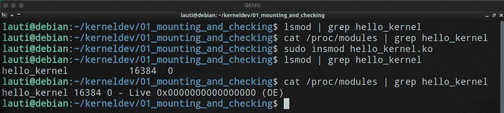
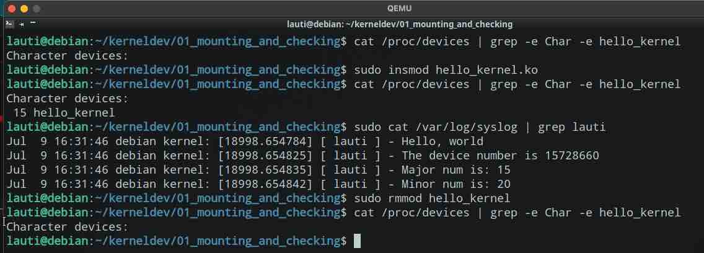
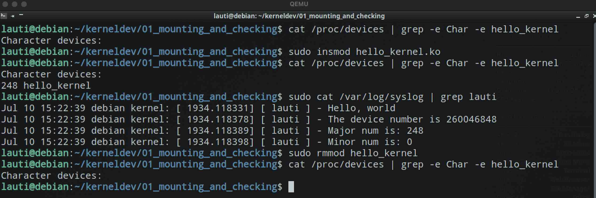

# Mounting and checking

Now we are going to try some little things like:

- checking if our module is listed between modules
- selecting some major and minor numbers for the module
- asking for some major and minor numbers dynamically

## Some changes in the environment

As we now are dividing these examples in different folders, it is a good idea to change the alias we were using in the guest to copy things from the host.

So, in our `.bashrc` we may want to recursively copy our latest project changes, and change ownership of the files we are copying.

So, where we had:

```sh
## IN THE GUEST ##
# .bashrc

alias lown='sudo cp /tmp/shared/dev/* /home/lauti/kerneldev/. \
            && cd /home/lauti/kerneldev/ \
            && sudo chown lauti:lauti *'
```

We could have something like

```sh
## IN THE GUEST ##
# .bashrc

alias lown='sudo cp -r /tmp/shared/dev/* /home/lauti/kerneldev/. \
            && cd /home/lauti/kerneldev/ \
            && sudo chown -R lauti:lauti ./'
```

## Listing our modules

Now that we have our module compiled, and now that we know we can mount it, let see if it appears in the list of kernel modules.

We will use the commands `lsmod` to list all the modules. Also we will check if it appears in the `/proc/modules` file.
As we know it will appear as `hello_kernel` we can check just for the lines containing that string by piping and greeping.



## Selecting Major and Minor numbers for the module

It steems not to be a good practice, but lets check how this API works.

We will modify some thing in the `hello_kernel.c` file. We will use some macros to get a `dev_t` to register our device region.
The full file [can be found here](./hello_kernel_static.c).
Then we will add some logs:

```c
// hello_kernel_static.c
#include <linux/init.h>
#include <linux/module.h>
#include <linux/types.h>
#include <linux/kdev_t.h>
#include <linux/fs.h>

MODULE_LICENSE("GPL");

// Making those numbers
const int devNum = MKDEV(15, 20);
const static int maj = MAJOR(devNum);
const static int min = MINOR(devNum);


static int hello_init(void) {
    // registering the device
    int err = register_chrdev_region(devNum, min, "hello_kernel");
    if (err != 0) {
        printk(KERN_ALERT "[ lauti ] - THIS IS NO GOOD, ERROR\n");
        return 1;
    }
    printk(KERN_ALERT "[ lauti ] - Hello, world\n");
    printk(KERN_ALERT "[ lauti ] - The device number is %d\n", devNum);
    printk(KERN_ALERT "[ lauti ] - Major num is: %d\n", maj);
    printk(KERN_ALERT "[ lauti ] - Minor num is: %d\n", min);
    return 0;
}

static void hello_exit(void) {
    // unregistering
    unregister_chrdev_region(devNum, min);
    printk(KERN_ALERT "[ lauti ] - Goodbye, cruel world\n");
}

module_init(hello_init);
module_exit(hello_exit);
```

We will send our files to our guest, compile and check if it was registered:

```sh
## GUEST ##

# remove module
sudo rmmod hello_kernel

# remove old system logs
sudo truncate -s 0 /var/log/syslog

# get the latest version of the source
lown

# move to the directory with our module
cd 01_mounting_and_checking

# compile
make

# mount the kernel module
sudo insmod hello_kernel.ko

# check if it appears between character devices
sudo cat /proc/devices | grep -e Char -e hello_kernel

# check if there numbers are the ones we expected
sudo cat /var/log/syslog | grep lauti
```

And this is what we got:



## Dynamically getting Major and Minor numbers

Now lets make some minor changes to our file. The full version [can be found here](./hello_kernel_dynamic.c):

```c
// hello_kernel_dynamic.c

// init the variables
static int devNum;
static int maj;
static int min = 0;
static int count = 4;


static int hello_init(void) {
    // registering the
    int result = alloc_chrdev_region(&devNum, min, count, "hello_kernel");
    if (result < 0) {
        printk(KERN_ALERT "[ lauti ] - THIS IS NO GOOD, ERROR\n");
        return result;
    }
    maj = MAJOR(devNum);
// the logs
//....
// then the same file as before
```

This way the kernel will be the one who decides which major number we should be using.

We re compile everything and get the following after testing:


