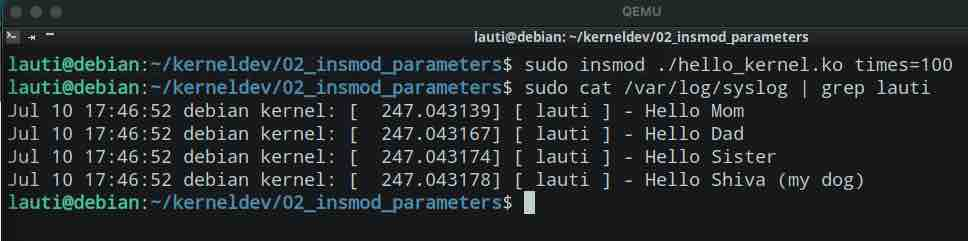

# Adding parameters when inserting the module

Now we will make the module accept some parameters.

As I want to say hi to my family we will do the following:

```c
// hello_kernel.c
#include // ...
#include <linux/moduleparam.h>

// ... stuff here
static int times;
char* family[] = { "Mom", "Dad", "Sister", "Shiva (my dog)" };
module_param(times, int, S_IRUGO);

static int hello_init(void) {
// ... registering the device and stuff
// ...
    int i;
       if (!times || times < 1 || times > 4) {
        times = 4;
    }
    for (i = 0; i < times; i++) {
        printk(KERN_ALERT "[ lauti ] - Hello %s \n", family[i]);
    }
// ...
// the rest of the module
```

The full module [can be found here](./hello_kernel.c)

This time we will compile and run the following command:

```bash
sudo insmod hello_kernel times=4
```

And these are the our kernel logs:


