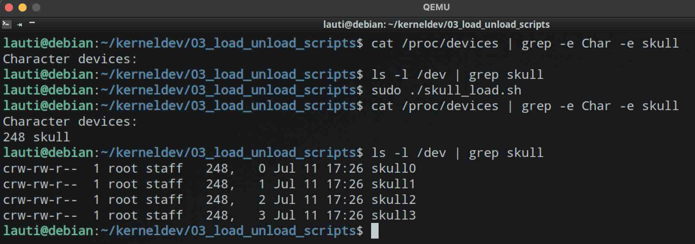

## Loading and unloading scripts

We used to name our driver `hello_kernel`. Although the book names their example as `scull`, ours will be called `skull` because I love skulls.

We will make a little script simillar to the one in chapter 3 of the book.

## The init file

1. First we define some variables that will be handy in the rest of hte script
2. we run insmod with the option of providing some extra arguments if needed
3. then we _awk like a pro_ the major number of our device
4. we get our group name
5. we loop and peform all operations needed

This last point might not be the best, because the removal of stale files depends on the success of each iteation. But we are learning as we go, we can change it later.

```bash
#!/bin/bash
module="skull"
device="skull"
mode="664"
maxDevIndex=3

/sbin/insmod $module.ko $* || exit 1

# select the group that will own the nodesgr
major=$(awk -v mod=$module '$2==mod {print $1}' /proc/devices)

# get staff or wheel group
group="staff"
grep -q '^staff:' /etc/group || group="wheel"

# remove all nodes and create all we need, with correct defaults
for i in $(seq 0 $maxDevIndex);
do
    rm -f /dev/${device}${i}
    mknod /dev/${device}${i} c $major $i
    chgrp $group /dev/${device}${i}
    chmod $mode /dev/${device}${i}
done
```

## The result

As we can see, we managed to insert the module, get the major version and create a file with the desired numbers, modes and groups.


