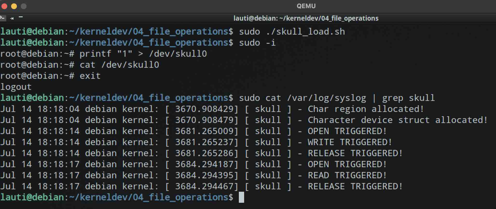

# Registering File Operations

For character devices, the kernel offers a way to trigger behaviour from userland into kernelspace by setting callbacks for the systemcalls one usually makes when interacting with files. What means: the character devices has the same interface as files.

Each time we `open`, `read`, `write`, `close`, etc to one of the files we created in [the last experiment](../03_load_script/), this can execute a callback defined in our kernel module.

The source code of our module can be [found here](skull.c)

For our case we will be just printing some stuff when those callbacks are triggered:

```c
static int open(struct inode* inode, struct file* filp) {
    printk(KERN_ALERT  "%s - OPEN TRIGGERED!\n", PREF);
    return 0;
};

static ssize_t read(struct file* filp, char __user* buf, size_t len, loff_t* off) {
    printk(KERN_ALERT  "%s - READ TRIGGERED!\n", PREF);
    return 0;
}

static ssize_t write(struct file* filp, const char __user* buf, size_t len, loff_t* off) {
    printk(KERN_ALERT  "%s - WRITE TRIGGERED!\n", PREF);
    return 0;
}

static int release(struct inode* inode, struct file* filp) {
    printk(KERN_ALERT  "%s - RELEASE TRIGGERED!\n", PREF);
    return 0;
}

static loff_t llseek(struct file* filp, loff_t off, int whence) {
    printk(KERN_ALERT  "%s - LLSEEK TRIGGERED!\n", PREF);
    return 0;
}
```

Then we associate those functions with the struct in charge of map them:

```c
static const struct file_operations fops = {
  .owner = THIS_MODULE,
  .open = open,
  .read = read,
  .write = write,
  .release = release,
  .llseek = llseek,
};
```

Finally, we need to initialize the struct that represents our character device:

```c
struct cdev skull_cdev;
///....
/// inside the init function:
alloc_chrdev_region(&devNum, min, count, SKULL);
cdev_init(&skull_cdev, &fops);
skull_cdev.owner = THIS_MODULE;
skull_cdev.ops = &fops;
cdev_add(&skull_cdev, devNum, 1);
```

For unregistering we need to follow the reverse flow:

```c
/// for error handling and
cdev_del(&skull_cdev);
unregister_chrdev_region(devNum, count);
```

So after loading our module we can interact with it and check if the callbacks were triggered:


