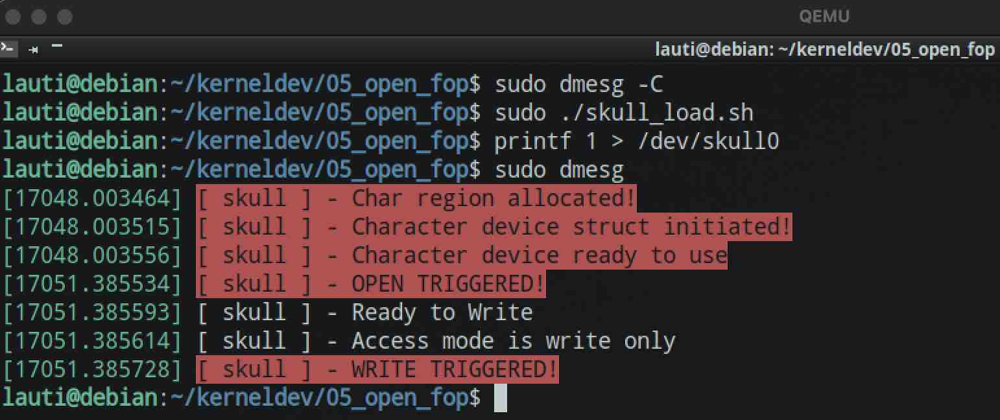

# Simplest Open File Operation

We will just set the `private_data` field to our file representation.
This will serve us to use any arbitrary data we might want to have in our `skull_d` struct.
More on this in [07_reading_from_private_data](../07_reading_from_private_data/).

```c
static int open(struct inode* inode, struct file* filp) {
    // Getting char device struct and adding it to private_data field
    struct skull_d* dev;
    dev = container_of(inode->i_cdev, struct skull_d, skull_cdev);
    filp->private_data = dev;

// ...

}
```

Also, we will check the mode this file was open based on the flags:

```c
// Checking access mode with f_flags
switch (filp->f_flags & O_ACCMODE) {
case O_WRONLY:
    pr_info("%s - Access mode is write only", PREF);
    break;
case O_RDONLY:
    pr_info("%s - Access mode is read only", PREF);
    break;
default:
    break;
}
```

And also with the `f_mode` field:

```c
// checking access mode with f_mode
if (filp->f_mode & FMODE_READ) {
    pr_info("%s - Ready to Read", PREF);
}

if (filp->f_mode & FMODE_WRITE) {
    pr_info("%s - Ready to Write", PREF);
}
```

To check the logs we will use `dsmeg`:


