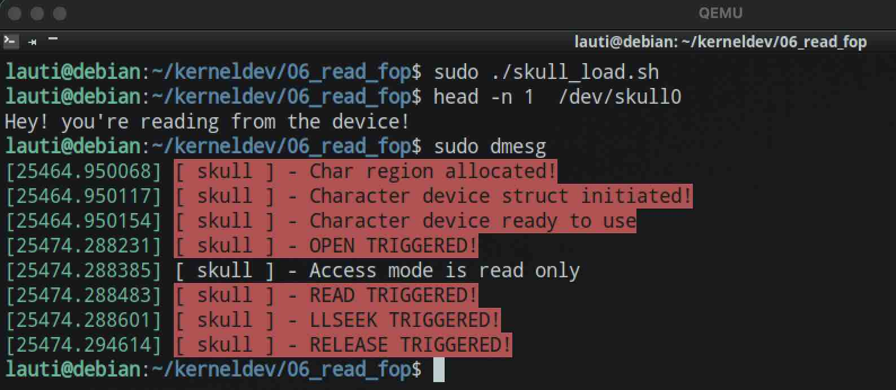

# Simplest Read File Operation

For our read, we will make it simple, we will just output a string:

```c
static ssize_t read(struct file* filp, char __user* buf, size_t len, loff_t* off) {
    int result;
    size_t count;
    char* data;
    data = "Hey! you're reading from the device!\n\0";
    pr_alert("%s - READ TRIGGERED!\n", PREF);
    count = strlen(data);
    result = copy_to_user(buf, data, count);
    return result == 0 ? count : -EFAULT;
}
```

And now, using `head -n 1` to read just one line:


