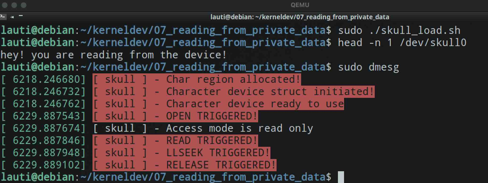

# Reading from private_data

In the [last example](../06_simplest_read_fop/) we read from a string that was generated on the fly, in the body of our `read` callback.

Now we will make some changes in our device struct so the data can be contained in there:

```c
struct skull_d {
    int maxData;
    char data[256];
    struct cdev skull_cdev;
};

static struct skull_d skull = { .maxData = 256, .data = "hey! you are reading from the device!\n\0" };
```

As we saw, in the `open` callback we assigned this struct to our `private_data` field of of our file.

```c
static int open(struct inode* inode, struct file* filp) {
    // Getting char device struct and adding it to private_data field
    struct skull_d* dev;
    dev = container_of(inode->i_cdev, struct skull_d, skull_cdev);
    filp->private_data = dev;
//...
}
```

This operation enable us to access that struct in any other callback, so we can now print the string stored in there:

```c
static ssize_t read(struct file* filp, char __user* buf, size_t len, loff_t* off) {
    int result;
    size_t count;
    struct skull_d* dev = filp->private_data;
    char* data = dev->data;
    pr_alert("%s - READ TRIGGERED!\n", PREF);
    count = strlen(data);
    result = copy_to_user(buf, data, count);
    return result == 0 ? count : -EFAULT;
}
```

So if we compile, load the device and use `head -n 1` to read one line:


