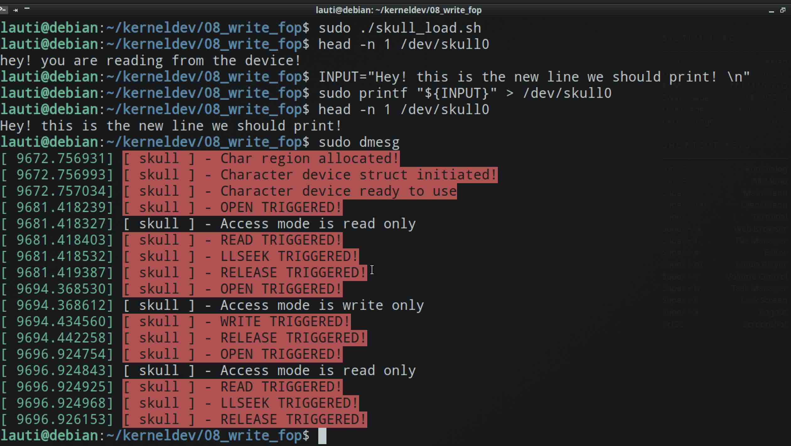

# Write file operation

Similar to what we did in [the last experiment](../07_reading_from_private_data/), we will attempt to write to the buffer we stored in `private_data`:

```c
static ssize_t write(struct file* filp, const char __user* buf, size_t len, loff_t* off) {
    int result;
    size_t count;
    struct skull_d* dev = filp->private_data;
    count = strlen(buf);
    result = copy_from_user(dev->data, buf, count);
    pr_alert("%s - WRITE TRIGGERED!\n", PREF);
    return result == 0 ? count : -EFAULT;
}
```

To check how everything went, we can:

1. read the initial data
2. try to override it
3. read it again and see the new string


