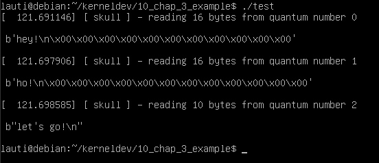

# Implementing scull from chapter 3 of LLD book

In [chapter 3 of the LDD book](https://static.lwn.net/images/pdf/LDD3/ch03.pdf) we are presented with a character device that implements a interesting way of handling memory.

Basically, the memory management is handled in the following way:

- Each device has a poiner to a head node of a linked list
- Each node contains a pointer to the next node, and also a pointer to an array of memory blocks of a fixed size.
- Each time you want to write something, you need to say to which offset you want to write. Based on that, you calculate in which node the data should be written, and in which block the data should be put.
- By using llseek calls you can traverse the list and the blocks to get the data you want.
- If you open the file in a write only mode, all data is erased.

In our example we rename some things so they are not too cryptic.
A full example of the device can be [found in this repo](https://github.com/martinezjavier/ldd3/blob/master/scull/main.c), but this is a full implementation of the whole device. In this chapter we make something similar, but trimming most of the things that will be shown in the next chapters of the book.
As we are trying to make a step by step guide, our example wont be including:

- semaphore/mutex
- pipes
- several devices
- seq_operations
- proc filesystem

All of those will be seen in later chapters.

## The new struct scheme

Our new device will have this structure:

```c
struct skull_d {
    struct node* data;        /* Pointer to first node of the linked lisit */
    int quantum;              /* the current quantum size */
    int qset;                 /* the current array size */
    unsigned long size;       /* amount of data stored here */
    struct cdev skull_cdev;
};
```

In the example, our `struct node*` type is the same as the `struct scull_qset*` from the book. But, as it is just a node in a linked list, we decided to call it just node.
Then `qset` is the amount of memory blocks in each node, while `quantum` is the size of each block. Then, `size` is the total amount of data allocated in our device.

The `node` struct looks like the following:

```c
struct node {
    struct node* next;
    void** data;
};
```

As we said above, we have a pointer to the next node, and also a pointer to the begining of a memory space. The `void**` type is kind of confusing but super useful. By doing this we can express that we are pointing to something that decays to a pointer, so it can give us lot of flexibility.

## Write operation

Now, when we want to write, we need to calculate some things:

- To which page should we write?
  - this is done by calculating offset divided by page size
- To which block of memory we should write within the page?
  - we take the reminder of the division above and divide it by the `quantum` size
- To which offset of that `quantum` we should be writing to?
  - we take the reminder of the division above and that will be the position

These calculations can be seen in this part of the code:

```c
static ssize_t write(struct file* filp, const char __user* buf, size_t len, loff_t* off) {
    //... several declaration due to C90 standar
    nodeIndex = (long)*off / pageSize;
    rest = (long)*off % pageSize;
    s_pos = rest / quantum; // the position within the page
    q_pos = rest % quantum; // the position within the quantum
}
```

Then, we can use our `getNodeByIndex` function (which is called `scull_follow` in the original) and get the corresponding node.
We will be allocating memmry on the fly if necessary. Then copy the buffer to that location and update the offset pointers.

```c
targetNode = getNodeByIndex(dev, nodeIndex);
    if (targetNode == NULL) goto out;

    // if the page doesn't exist
    if (!targetNode->data) {
        targetNode->data = kmalloc(qset * sizeof(char*), GFP_KERNEL);

        if (targetNode->data == NULL)
            goto out;
        memset(targetNode->data, 0, qset * sizeof(char*));
    }
    // if that quantum doesn't exist
    if (!targetNode->data[s_pos]) {
        targetNode->data[s_pos] = kmalloc(quantum, GFP_KERNEL);
        if (!targetNode->data[s_pos])
            goto out;
    }
    // do not write more than a quantum
    if (len > quantum - q_pos)
        len = quantum - q_pos;

    if (copy_from_user(targetNode->data[s_pos] + q_pos, buf, len)) {
        result = -EFAULT;
        goto out;
    }
    // tell the caller where is the cursor now
    *off = *off + len;
    result = len;
    if (dev->size < *off)
        dev->size = *off;
out:
    return result;
```

## The `getNodeByIndex` function

In the original example it's called `scull_follow`. This function basically traverse the list up to the desired node, allocating them if needed.
Keep in mind that it just allocates the memory for the node (a struct with two pointers), not all the memory for all the blocks within a node.

```c
static struct node* getNodeByIndex(struct skull_d* dev, int index) {
    struct node* targetNode = dev->data;
    if (!targetNode) {
        targetNode = dev->data = kmalloc(sizeof(struct node), GFP_KERNEL);
        if (targetNode == NULL) return NULL;
        memset(targetNode, 0, sizeof(struct node));
    }

    while (index--) {
        if (!targetNode->next) {
            targetNode->next = kmalloc(sizeof(struct node), GFP_KERNEL);
            if (targetNode->next == NULL) return NULL;
            memset(targetNode->next, 0, sizeof(struct node));
        }
        targetNode = targetNode->next;
        continue;
    }
    return targetNode;
}
```

## Read operation

Reading is almost the same as writing when calculating the offsets to reach the desired node and memory block within the node.
The main difference is that we won't be allocating anything if there is nothing written to the ofset we are looking for.

```c
static ssize_t read(struct file* filp, char __user* buf, size_t len, loff_t* off) {
    //...
    if (dev->size < *off) {
        goto out;
    }
    //...
    targetNode = getNodeByIndex(dev, nodeIndex);

    if (targetNode == NULL || !targetNode->data || !targetNode->data[s_pos]) {
       goto out;
   }
}
```

If you read the [whole example](skull.c) you will see the structural homologies with the write method.

## Llseek operation

We use `llseek` to navigate through the file once it's open. The function takes 3 arguments: the file, a number representing the offset we need to move, and the mode.

The modes are 3:

- start from the begining and move
- start from where you are right now
- start from the end of the file

```c
static loff_t llseek(struct file* filp, loff_t off, int whence) {
    struct skull_d* dev;
    loff_t newpos;
    dev = filp->private_data;
    switch (whence) {
    case 0: /* SEEK_SET (start from the begining of the file)*/
        newpos = off;
        break;

    case 1: /* SEEK_CUR (start from where you are right now)*/
        newpos = filp->f_pos + off;
        break;

    case 2: /* SEEK_END (start from the end of the file)*/
        newpos = dev->size + off;
        break;

    default: /* can't happen */
        return -EINVAL;
    }
    if (newpos < 0) return -EINVAL;
    filp->f_pos = newpos; // update the position
    return newpos;
}
```

## `skull_trim` function

We need a function to cleanup all the memory we allocated.
This is needed both when removing the device, but also when opening with write only perms. As we can see in the following snippet:

```c
static int open(struct inode* inode, struct file* filp) {
   //...
    if ((filp->f_flags & O_ACCMODE) == O_WRONLY) {
        skull_trim(dev);
    }
};
```

The trimming is done by looping over each node in our linked list, and thentrying to free each memory block that could exist.
Then, we proceed to remove the actual node. Finally, we set the defaults.

```c
int skull_trim(struct skull_d* dev) {
    struct node* currentNode;
    struct node* nextNode;
    int qset = dev->qset;
    int i;

    // this reads as:
    // 1. starting with the current node;
    // 2. while current node is not NULL;
    // 3. current node is nextNode after each iteration
    for (currentNode = dev->data; currentNode; currentNode = nextNode) {
        if (currentNode->data) {
            for (i = 0; i < qset; i++) {
                kfree(currentNode->data[i]);
            }
            kfree(currentNode->data);
            currentNode->data = NULL;
        }
        nextNode = currentNode->next;
        kfree(currentNode);
    }
    dev->size = 0;
    dev->qset = Q_SET_SIZE;
    dev->quantum = QUANTUM_SIZE;
    dev->data = NULL;
    return 0;
}
```

## Playing and Testing

To play around with this implementation, I decided to make a little python script that opens the file, writes a little bit of a chorus from a Ramone's song and then attempts to read it.

```py
#! /bin/python3
import os
device = "/dev/skull0"
pageSize = 16

fd = os.open(device, os.O_RDWR)
os.write(fd, b"hey!\n")

os.lseek(fd, pageSize, 0)
os.write(fd, b"ho!\n")

os.lseek(fd, pageSize*2, 0)
os.write(fd, b"let's go!\n")

os.lseek(fd, 0, 0)

i = 0
while i<3:
    b = os.read(fd, 16)
    print("\n",b,"\n")
    i+=1
```

If you run it after mounting the device you get something like the following:


