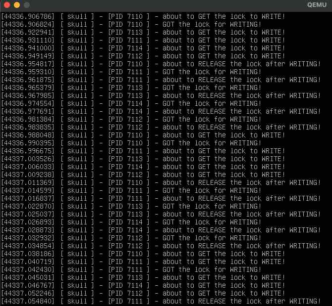

# Introducing the mutex

This experiment correlates with what is exposed on [chapter 5 of the linux device drivers book](https://static.lwn.net/images/pdf/LDD3/ch05.pdf) called "concurrency and race conditions".

The thing here is that neither the reads, nor the writes are orchestrated at this point. Each time some process tries to write or read from the device, it is trying to access some part of the memory as if no one else is doing something with it.

To avoid the case where two ore more processes are attempting to do something with the same memory, we can introduce an orchestration mechanism. In our case we will use mutex.

If you want to know a little bit more about mutex, please follow the next links:

- https://www.kernel.org/doc/html/latest/kernel-hacking/locking.html
- https://www.kernel.org/doc/html/latest/kernel-hacking/locking.html#locking-only-in-user-context

## Initializing the mutex

Our device struct will have a new field called `lock`, which will hold the mutex struct:

```c
struct skull_d {
    struct node* data;
    int quantum;
    int qset;
    unsigned long size;
    struct mutex lock; // --> this is the lock
    struct cdev skull_cdev;
};
```

We will initialize the mutex just before making our device visible:

```c
static int init_skull(void) {
    int err = alloc_chrdev_region(&devNum, min, count, SKULL);
    if (err != 0) goto error;
    cdev_init(&skull.skull_cdev, &fops);
    skull.skull_cdev.owner = THIS_MODULE;
    skull.skull_cdev.ops = &fops;

    mutex_init(&skull.lock); // -> this inits the mutex

    /* just before the cdev_add call */
    err = cdev_add(&skull.skull_cdev, devNum, 1);

    // ...
}
```

## Locking/unlocking

In the `write` callback, we will get the lock before trying to access the memory, and then we will unlock just before returning.

```c
static ssize_t write(struct file* filp, const char __user* buf, size_t len, loff_t* off) {
    struct skull_d* dev;
    struct node* targetNode;

    // ... initializations and delcarations here

    pr_info("%s - [PID %d ] - about to GET the lock to WRITE!", PREF, current->pid);

    // get the lock or sleep
    if (mutex_lock_interruptible(&dev->lock)) {
        pr_alert("%s - we were killed while waiting", PREF);
        return -ERESTARTSYS;
    }
    pr_info("%s - [PID %d ] - GOT the lock for WRITING!", PREF, current->pid);

    targetNode = getNodeByIndex(dev, nodeIndex);
    if (targetNode == NULL) {
        goto out;
    }
    // ... go to the page and quantum, and then modify the memory in there

out:
    pr_info("%s - [PID %d ] - about to RELEASE the lock after WRITING!", PREF, current->pid);
    mutex_unlock(&dev->lock); // -> we unlock lock here
    return result;
```

For the `read` operation is almost the same:

```c
static ssize_t read(struct file* filp, char __user* buf, size_t len, loff_t* off) {
    struct skull_d* dev;
    struct node* targetNode;
    //... initializations

    pr_info("%s - [PID %d ] - about to GET the lock to READ!", PREF, current->pid);

    // get the lock or sleep
    if (mutex_lock_interruptible(&dev->lock)) {
        pr_alert("%s - we were killed while waiting");
        return -ERESTARTSYS;
    }
    pr_info("%s - [PID %d ] - GOT the lock for READING!", PREF, current->pid);

    // ...

    targetNode = getNodeByIndex(dev, nodeIndex);

    // .. read from the node

out:
    pr_info("%s - [PID %d ] - about to RELEASE the lock after READING!", PREF, current->pid);
    mutex_unlock(&dev->lock);
    return result;

}
```

## Testing

A simple way to see how this mutex behaves is to spawn some processes that tries to use the device concurrently. To do it, we can use [the same test we used in the last experiment](./test) and then check the kernel logs.

So first we do something like:

```bash
for i in $(seq 0 4); do ./test& done
```

After that we can check the kernel logs with:

```bash
sudo dmesg | less
```

If you read carefully, you will see some situations where several processes tried to get the lock but only one succeeded:


