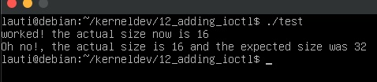
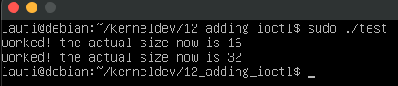

# IOCTL Operation

The ioctl (input output control) seems to be a syscall that allows lot of flexibility for implementing functionalities into our module.
It acts as a controller where we can pass previously defined commands and arbitrary inputs.
The inputs can be both values or pointers to things living in userspace.
Although it provides an interface to implement lot of functionallities, it also couples lot things into the same entry point.

If you want to get some extra references on this, please follow the next links:

- [Advanced Char Driver Operations - LDD3 PDF](https://static.lwn.net/images/pdf/LDD3/ch06.pdf)
- [ioctl based interfaces > drivers api > kernel docs](https://docs.kernel.org/driver-api/ioctl.html)

for our example, we decided to change some things in the device:
We will keep the following definitions:

```c
#define Q_SET_SIZE   16
#define QUANTUM_SIZE 16
```

But they will be used for initializing some variables:

```c
int qset_size = Q_SET_SIZE;
int  quantum_size = QUANTUM_SIZE;
```

Which then will be used as:

```c
int skull_trim(struct skull_d* dev) {
    // ...
    dev->size = 0;
    dev->qset = qset_size;
    dev->quantum = quantum_size;
    dev->data = NULL;
    return 0;
}
```

Our IOCTL call will be messing with this variables, so after each trim we will be reconfiguring the paging.

## IOCTL signature

Fo our driver, we will use ioctl to modify the `quantum` size and que `qset` size at runtime.
We will follow the interface proposed in the LDD3 book exploring all the semantics they propose..

If we see how is the function proptotype we will have the following:

```c
long ioctl(struct file* filp, unsigned int cmd, unsigned long arg)
```

As with the other file operations we have a pointer to the file, then we have a positive number that will be used to signal which operation we should be doing, and finally another positive number that will be both a user input or a value that will hold a reference to a memory space where we can deposit a return value.

The returned value can be used for signaling a success, returning a value, or also signaling a failure.

## Defining commands

To define commands we first need to select a "magic number" that will be used to keep track of which operations are targeting our device:
This should be an 8bit number.
In our case we use:

```c
#define SKULL_IOC_MAGIC             0xCD
```

Then, there is a set of macros that can be used to define the type of command: `_IO _IOR _IOW _IOWR`. As you can imagine from the Rs and Ws, they they are used depending on if one needs to read, write, none, or both, from/to userspace.

We will implement the same set of commands as in the book just to explore the semantics this file operations provides:

```c
#define SKULL_IOC_RESET             _IO(SKULL_IOC_MAGIC,    0)
#define SKULL_IOC_SET_QUANTUM       _IOW(SKULL_IOC_MAGIC,   1, int)
#define SKULL_IOC_SET_QSET          _IOW(SKULL_IOC_MAGIC,   2, int)
#define SKULL_IOC_TELL_QUANTUM      _IO(SKULL_IOC_MAGIC,    3)
#define SKULL_IOC_TELL_QSET         _IO(SKULL_IOC_MAGIC,    4)
#define SKULL_IOC_GET_QUANTUM       _IOR(SKULL_IOC_MAGIC,   5 , int)
#define SKULL_IOC_GET_QSET          _IOR(SKULL_IOC_MAGIC,   6 , int)
#define SKULL_IOC_QUERY_QUANTUM     _IO(SKULL_IOC_MAGIC,    7)
#define SKULL_IOC_QUERY_QSET        _IO(SKULL_IOC_MAGIC,    8)
#define SKULL_IOC_EXCHANGE_QUANTUM  _IOWR(SKULL_IOC_MAGIC,  9, int)
#define SKULL_IOC_EXCHANGE_QSET     _IOWR(SKULL_IOC_MAGIC,  10, int)
#define SKULL_IOC_SHIFT_QUANTUM     _IO(SKULL_IOC_MAGIC,    11)
#define SKULL_IOC_SHIFT_QSET        _IO(SKULL_IOC_MAGIC,    12)
```

As one can see, we pass the magic number, we select a number to represent the command, and an optional type for the kind of argument passed.

## Handling calls

Before running the logic of our commands we need to make some checkings:

```c
long ioctl(struct file* filp, unsigned int cmd, unsigned long arg) {
    // initializations
    unsigned int dir;
    int err = 0, tmp;
    int result = 0;
    // is this command for us?
    if (_IOC_TYPE(cmd) != SKULL_IOC_MAGIC) return -ENOTTY;
    // is the command in the list of allowed commands?
    if (_IOC_NR(cmd) > SKULL_IOC_MAXNR) return -ENOTTY

    // is this commnad reading or writing form/to userspace?
    dir = _IOC_DIR(cmd);
    if (dir & _IOC_READ || dir & IOCB_WRITE) {
        // can we proceed?
        err = !access_ok((void __user*)arg, _IOC_SIZE(cmd));
    }
    if (err) return -EFAULT;
```

For the handler, we can use a switch statement:

```c
long ioctl(struct file* filp, unsigned int cmd, unsigned long arg) {
    // ... initializations
    int result = 0;
    // ... checkings
    switch (cmd) {
    case SKULL_IOC_RESET: /* set the default valuees */
        quantum_size = QUANTUM_SIZE;
        qset_size = Q_SET_SIZE;
        break;
    case SKULL_IOC_SET_QUANTUM: /* set variable from pointer */
        if (!capable(CAP_SYS_ADMIN)) return -EPERM;
        result = __get_user(quantum_size, (int __user*) arg);
        break;
    // ... other commands
    case SKULL_IOC_QUERY_QUANTUM: /* size is positive, so we can return it to userspace */
        return quantum_size;
    // ... more commands
    default:
        return -ENOTTY;
    }
    return result;
}
```

For the full implementation please check [the source file](./skull.c), for now we will be using these, as they are the one we use in our test.
As we can see, depending on the command, we can trigger functionality.
Here, the interesting things are:

- you can return a positive number from kernelspace.
- you can check capabilities of the user who is calling the syscall.
- you can read from userspace using a pointer to arbitrary data.
- you can write to userspace the same way.

## Testing

If we go to our test file we can do something like:

```c
#include <stdlib.h>
#include <stdio.h>
#include <fcntl.h>
#include <sys/ioctl.h>
#include "test.h"


int main(void) {
    int newQuantumSize = 32;
    int fd = open("/dev/skull0", O_RDWR);
    ioctl(fd, SKULL_IOC_RESET);
    int actualQuantumSize = ioctl(fd, SKULL_IOC_QUERY_QUANTUM);
    if (actualQuantumSize != QUANTUM_SIZE) {
        printf("Oh no!, the actual size is %d and the expected size was %d\n", actualQuantumSize, QUANTUM_SIZE);
    }
    else {
        printf("worked! the actual size now is %d\n", actualQuantumSize);
    }
    int res = ioctl(fd, SKULL_IOC_SET_QUANTUM, &newQuantumSize);
    actualQuantumSize = ioctl(fd, SKULL_IOC_QUERY_QUANTUM);
    if (actualQuantumSize == QUANTUM_SIZE) {
        printf("Oh no!, the actual size is %d and the expected size was %d\n", actualQuantumSize, newQuantumSize);
    }
    else {
        printf("worked! the actual size now is %d\n", actualQuantumSize);
    }
    return 0;
}
```

And indeed, it seems to work
We cant change the quantum size if we are not root:



But we can when running the program with sudo:

