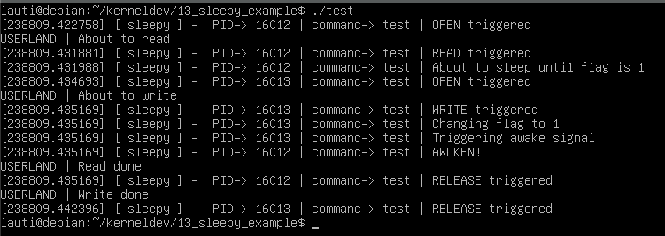
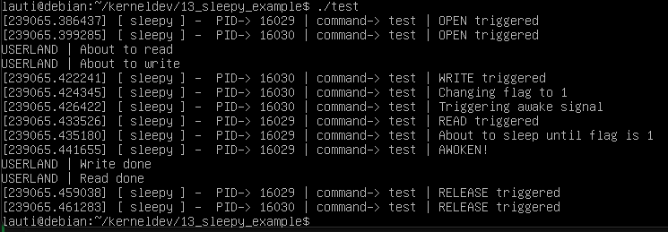

# Concurrency & orchestration - sleep & wait queues

If you want, you can send a process to sleep until a condition is met.
Then, you can signal them to awaken when necessary.

A little bit of context of this API can be found here:

- [Simple Wait Queues - LWN](https://lwn.net/Articles/577370/)
- [The return of simple wait queues - LWN](https://lwn.net/Articles/661424/)
- [Wait Queues > kernel docs](https://docs.kernel.org/kernel-hacking/hacking.html#wait-queues-include-linux-wait-h)

To declare a wait queue we will use the macro

```c
static DECLARE_WAIT_QUEUE_HEAD(wq);
```

For experiment we will implement the following logic:

- when reading, sleep if a static variable "flag" is not "1"
- when writing, turn that "flag" to "1", and wake up everyone

```c
static int flag = 0;

static ssize_t read(struct file* filp, char __user* buf, size_t len, loff_t* off) {
    // logging some info to keep track of the orchestration
    pr_info("%s PID-> %d | command-> %s | READ triggered\n", PREF, current->pid, current->comm);
    pr_info("%s PID-> %d | command-> %s | About to sleep until flag is 1\n", PREF, current->pid, current->comm);

    // the cool part
    wait_event_interruptible(wq, flag == 1);
    flag = 0;

    // happy ending
    pr_info("%s PID-> %d | command-> %s | AWOKEN!\n", PREF, current->pid, current->comm);
    return 0;
}

static ssize_t write(struct file* filp, const char __user* buf, size_t len, loff_t* off) {
    // logging some info to keep track of the orchestration
    pr_info("%s PID-> %d | command-> %s | WRITE triggered\n", PREF, current->pid, current->comm);
    pr_info("%s PID-> %d | command-> %s | Changing flag to 1\n", PREF, current->pid, current->comm);

    // happy ending
    flag = 1;
    pr_info("%s PID-> %d | command-> %s | Triggering awake signal\n", PREF, current->pid, current->comm);
    wake_up_interruptible(&wq);
    return count;
}
```

The rest of the implementation is trivial, is just a `cdev` structure with some file operations.
We are not using the actual data sent to the "write" call, nor are we reading anything meaningful.
We just want to see how this sleep logic behaves

## Testing

For testing, we will use a little python script to spawn to processes which will read and write.
We will `join` on read, since it will be the one that will be put to sleep until "write" changes the state of the flag and wakes up the "read" process.

```py
#! /bin/python3
import os
from multiprocessing import Process
def read():
    fd = os.open("/dev/sleepy0", os.O_RDONLY)
    print("USERLAND | About to read")
    os.read(fd, 1)
    print("USERLAND | Read done")
    os.close(fd)

def write():
    fd = os.open("/dev/sleepy0", os.O_WRONLY)
    print("USERLAND | About to write")
    os.write(fd, b"1")
    print("USERLAND | Write done")
    os.close(fd)

r = Process(target=read)
w = Process(target=write)

r.start()
w.start()
r.join()
```

Then, if we trigger the test we will have the following:



As we can seee, the we attempt to read and then the process is put to sleep.
Then we write and signal a wake up.
Finally everything continues until it finishes.

Is worth to notice that one needs to be carefull and know that after the wake up call we do not have any guarantee on how the scheduler will schedule the remainding work. For example, in the next example, everything looks the same only until the `AWOKEN!` log:

