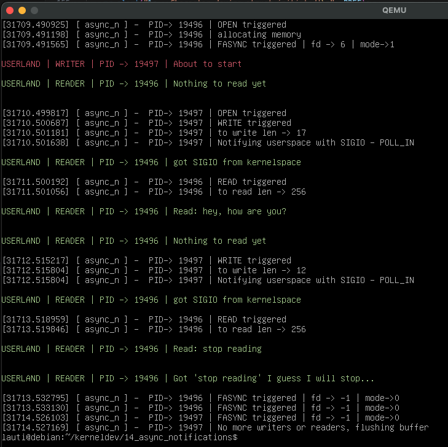

# Asynchronous Notifications

For this experiment we will create a device that holds a buffer of a fixed size.

The buffer is dynamically allocated on open, and freed when no more readers or writers are using it.

A writer process will lock a mutex when trying to write. Each write will override what was in the buffer before, and then it will send a `SIGIO` signal to the readers notifying that there is something to read.

The reader process will have a variable indicating if there is something to read or not, initially set to "there is nothing to read". Then it will loop while checking that variable. A handler will be set for when a `SIGIO` signal is received, and that will change the value of the variable indicating that now it can start reading the buffer.

## The device struct

Our device will have a pointer to a struct, and some unsigned ints to keep track of the buffer size, th readers and writers. It will hacve a mutex, a `struct cdev` and also a pointer to an `fasync_struct` wich will serve us to notify userspace processes.

```c
struct async_n_dev_t {
    char* buff;
    unsigned int buffSize;
    unsigned int numOfReaders;
    unsigned int numOfWriters;
    struct fasync_struct* async_queue;
    struct mutex lock;
    struct cdev cdev;
};
```

Initialization will look like this:

```c
static struct async_n_dev_t async_d = { .buffSize = 256, .numOfReaders = 0, .numOfWriters = 0 };

/* file operations declarations .... */

static const struct file_operations fops = {
  .owner = THIS_MODULE,
  .open = open,
  .read = read,
  .write = write,
  .release = release,
  .fasync = fasync,
};

static int init(void) {
    int err;
    err = alloc_chrdev_region(&devNum, min, count, ASYNC);
    /* initializations and error handling*/
    cdev_init(&async_d.cdev, &fops);
    async_d.cdev.owner = THIS_MODULE;
    async_d.cdev.ops = &fops;
    mutex_init(&async_d.lock); //-> mutex initialization
    err = cdev_add(&async_d.cdev, devNum, 1);
    /*more error handling and returning*/
}
```

## FASYNC file operation

The main tasks in this operation are:

- locking before and unlocking after the critical parts
- allocate the buffer if there is no one yet
- increase the readers/writers counts depending on the f_mode flags
- set the device as non seekable

```c
static int open(struct inode* inode, struct file* filp) {
    struct async_n_dev_t* dev;
    dev = container_of(inode->i_cdev, struct async_n_dev_t, cdev);
    filp->private_data = dev;
    pr_info("%s PID-> %d | OPEN triggered\n", PREF, current->pid);
    if (mutex_lock_interruptible(&dev->lock)) {
        pr_info("%s PID-> %d | could not get mutex\n", PREF, current->pid);
        // make the vfs take care or re try the syscall
        // this should be transparent for the userspace process
        return -ERESTARTSYS;
    }
    if (!dev->buff) {
        pr_info("%s PID-> %d | allocating memory\n", PREF, current->pid);
        dev->buff = kmalloc(dev->buffSize, GFP_KERNEL);
        if (!dev->buff) {
            mutex_unlock(&dev->lock);
            // it seemts there is no memory
            return -ENOMEM;
        }
    }
    // check flags
    if (filp->f_mode & FMODE_READ) {
        dev->numOfReaders++;
    }
    // check flags
    if (filp->f_mode & FMODE_WRITE) {
        dev->numOfWriters++;
    }
    mutex_unlock(&dev->lock);

    // do not seek this device
    return nonseekable_open(inode, filp);
};
```

## FASYNC file operation

It seems that "fasync" stands for "file asynchronous.
By using this call, a process can suscribe for asynchronous notifications by registering itself into a `fasync_queue`.
The kernel already provides a general implementation of this process, so we can just use `fasync_helper` to get things done:

```c
static int fasync(int fd, struct file* filp, int mode) {
    struct async_n_dev_t* dev = filp->private_data;
    pr_info("%s PID-> %d | FASYNC triggered | fd -> %d | mode->%d\n", PREF, current->pid, fd, mode);
    return fasync_helper(fd, filp, mode, &dev->async_queue);
}
```

As we can see, the helper takes all its arguments from the ones passed to the file operation, with the exception of the `async_queue` which is part of the device itself.

## RELEASE file operation

When releasing the file, we need to update the writers/writers accordingly, unsuscribe ourselves as potential suscribers for the async notifications, and freeing the buffer if necessary:

```c
static int release(struct inode* inode, struct file* filp) {
    struct async_n_dev_t* dev;
    dev = filp->private_data;

    // unsisribing ourselves
    fasync(-1, filp, 0);
    mutex_lock(&dev->lock);
    // updating readers count
    if (filp->f_mode & FMODE_READ) {
        dev->numOfReaders--;
    }
    // updating writers count
    if (filp->f_mode & FMODE_WRITE) {
        dev->numOfWriters--;
    }
    // freeing the buffer
    if (dev->numOfReaders + dev->numOfWriters == 0) {
        pr_info("%s PID-> %d | No more writers or readers, flushing buffer \n", PREF, current->pid);
        kfree(dev->buff);
        dev->buff = NULL;
    }
    mutex_unlock(&dev->lock);
    return 0;
}
```

## READ file operation

Reading is quite simple. We just need to get the lock, make sure we are not reading more than the max size of the buffer, and then just copy the data to the user buffer:

```c
static ssize_t read(struct file* filp, char __user* buf, size_t len, loff_t* off) {
    struct async_n_dev_t* dev;
    dev = filp->private_data;
    pr_info("%s PID-> %d | READ triggered\n", PREF, current->pid);

    // lock or let the fs retry the read
    if (mutex_lock_interruptible(&dev->lock)) {
        pr_info("%s PID-> %d | couldn't held the lock\n", PREF, current->pid);
        return -ERESTARTSYS;
    }
    // copy only up to the max buff size
    if (len > dev->buffSize) {
        len = dev->buffSize;
    }
    pr_info("%s PID-> %d | to read len -> %ld \n", PREF, current->pid, len);
    // copy to user
    if (copy_to_user(buf, dev->buff, len)) {
        mutex_unlock(&dev->lock);
        return -EFAULT;
    }
    // return the number of read bytes
    mutex_unlock(&dev->lock);
    return len;
}
```

## WRITE file operation

Here is where the magic happens. The process is smilar to a normal read: we get the lock, make sure we are not trying to read more than the buffer size, copy from the user, and then trigger `fasync_kill`.

This last function will notify everyone who is registered in the `fasync_queue`.

```c
static ssize_t write(struct file* filp, const char __user* buf, size_t len, loff_t* off) {
    struct async_n_dev_t* dev;
    dev = filp->private_data;
    pr_info("%s PID-> %d | WRITE triggered\n", PREF, current->pid);

    // get the lock or retry
    if (mutex_lock_interruptible(&dev->lock)) {
        return -ERESTARTSYS;
    }
    // only write up to the buffer size
    len = min(len, (size_t)dev->buffSize);
    pr_info("%s PID-> %d | to write len -> %ld\n", PREF, current->pid, len);
    // clean the buffer
    memset(dev->buff, 0, dev->buffSize);
    // copy to the buffer
    if (copy_from_user(dev->buff, buf, len)) {
        mutex_unlock(&dev->lock);
        return -EFAULT;
    }
    mutex_unlock(&dev->lock);
    // if we have a queue send a SIGIO signal to all process registered there
    if (dev->async_queue) {
        pr_info("%s PID-> %d | Notifying userspace with SIGIO - POLL_IN\n", PREF, current->pid, len);
        kill_fasync(&dev->async_queue, SIGIO, POLL_IN);
    }
    return len;
}
```

## Testing

For testing we will do the following:

1. using python, spawn two processes, one for writing and one for reading.
2. both will interact with the device and loop to write/read.
3. the reader will try to read more frequently

For the writer:

1. it will have a list with things to write, te last one will put "stop reading"
2. after each write, it will sleep for two seconds
3. when nothing is left to be written, close the file.

For the reader:

1. the reader will define a flag that will be set to `True` when there is something to read
2. it will set a handler for `SIGIO` signals received, so we can set the flag above to `True` when one arrives
3. it will open the file and then use `fcntl` to set itself as owner and to set `FASYNC` flags
4. finally, it will loop every second until it reads `stop reading` from the device. If the flag is set to `False` it just sleeps for one second, if it is `True` it attempts to read.

```py
#! /bin/python3
import os
import fcntl
import signal
from multiprocessing import Process
from time import sleep

def read():
    # set variables
    text=""
    somethingToRead = False
    retries = 0
    # the handler will change the flag above
    def sigioHandler(signum, frame):
            print(f"\033[0;32m\nUSERLAND | READER | PID -> {os.getpid()} | got SIGIO from kernelspace\n\033[0;0m")
            nonlocal somethingToRead
            somethingToRead = True

    #set the signal handler (in our case 29 is SIGIO)
    signal.signal(signalnum=29, handler=sigioHandler)

    # open the device and set all fcntl operations
    fd = os.open("/dev/async_n0", os.O_RDONLY)

    fcntl.fcntl(fd, fcntl.F_SETOWN, os.getpid())

    currentFlags = fcntl.fcntl(fd, fcntl.F_GETFL)

    fcntl.fcntl(fd, fcntl.F_SETFL, currentFlags | fcntl.FASYNC)

    # start looping
    while "stop reading" not in text:
        retries+=1
        sleep(1)
        # if nothing to read, just go to sleep again
        if somethingToRead == False:
            print(f"\033[0;32m\nUSERLAND | READER | PID -> {os.getpid()} | Nothing to read yet\n\033[0;0m")
            continue
        # but if we have somehting, read up to 256 bytes
        text = os.read(fd, 256).decode("utf-8")
        print(f"\033[0;32m\nUSERLAND | READER | PID -> {os.getpid()} | Read: {text}\n\033[0;0m")
        # and reset
        somethingToRead = False
    # at this point, we exited the loop
    print(f"\033[0;32m\nUSERLAND | READER | PID -> {os.getpid()} | Got '{text}' I guess I will stop...\n\033[0;0m")
    os.close(fd)

def write():
    sleep(1)
    print(f"\033[1;31m\nUSERLAND | WRITER | PID -> {os.getpid()} | About to start\n\033[0;0m")
    # make the list with the text we want to write
    toWrite = ["hey, how are you?", "stop reading"]
    i = 0
    fd = os.open("/dev/async_n0", os.O_WRONLY)
    # loop one time for each member of the list
    while i < 2:
        # write and sleep
        os.write(fd, toWrite[i].encode("utf-8"))
        i+=1
        sleep(2)
    os.close(fd)

# set up the processes
r = Process(target=read)
w = Process(target=write)

# start them and wait on the weiter, which should take more time to complete than the reader
r.start()
w.start()
w.join()
```

After testing we got the following:



