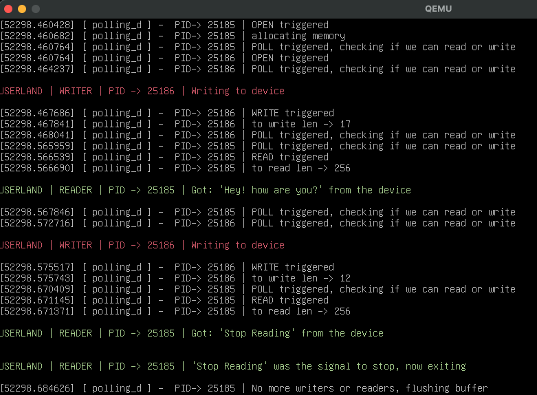

# POLLING file operation

For our polling operation we will re use most of [the code of the previous example](../14_async_notifications/).

There will be some differences:

- Writers will need to wait until a reader consumes the message
- The buffer will be cleaned on every read
- Each of those operations will set a flag depending on if there is someting to read or not
- When polling, the bitmask will be set depending on that flag

## The device struct

This time, our device will use two wait queue heads for the polling operations, and a new int to signal if the buffer is empty or not.

```c
struct polling_dev_t {
    char* buff;
    unsigned int buffSize, buffNotEmpty;
    unsigned int numOfReaders, numOfWriters;
    wait_queue_head_t inq, outq;
    struct mutex lock;
    struct cdev cdev;
};

```

## Initialization

To init our device we need to instantiate the mutex and the two wait queues:

```c
static struct polling_dev_t polling_d = { .buffSize = 256, .numOfReaders = 0, .numOfWriters = 0, .buffNotEmpty = 0 };

static int init(void) {
    int err;
    err = alloc_chrdev_region(&devNum, min, count, ASYNC);
    /* error handling here */

    cdev_init(&polling_d.cdev, &fops);
    polling_d.cdev.owner = THIS_MODULE;
    polling_d.cdev.ops = &fops;
    mutex_init(&polling_d.lock);
    init_waitqueue_head(&polling_d.inq); // the two wait queuess
    init_waitqueue_head(&polling_d.outq);

    err = cdev_add(&polling_d.cdev, devNum, 1);
    /* more error handling over here*/
    //... and return
}
```

## WRITE operation

Write is almost the same as the previous example:

```c
static ssize_t write(struct file* filp, const char __user* buf, size_t len, loff_t* off) {
    struct polling_dev_t* dev;
    dev = filp->private_data;
    pr_info("%s PID-> %d | WRITE triggered\n", PREF, current->pid);
    if (mutex_lock_interruptible(&dev->lock)) {
        return -ERESTARTSYS;
    }
    len = min(len, (size_t)dev->buffSize);
    pr_info("%s PID-> %d | to write len -> %ld\n", PREF, current->pid, len);
    memset(dev->buff, 0, dev->buffSize);
    if (copy_from_user(dev->buff, buf, len)) {
        mutex_unlock(&dev->lock);
        return -EFAULT;
    }
    // Instead of sending a signal, we just set this int to 1 (true)
    dev->buffNotEmpty = 1;
    mutex_unlock(&dev->lock);
    return len;
}
```

## READ operation

Again, reading is almost the same as in the previour example. The main difference is that we clear the message after reading it:

```c
static ssize_t read(struct file* filp, char __user* buf, size_t len, loff_t* off) {
    struct polling_dev_t* dev;
    dev = filp->private_data;
    pr_info("%s PID-> %d | READ triggered\n", PREF, current->pid);
    if (mutex_lock_interruptible(&dev->lock)) {
        pr_info("%s PID-> %d | couldn't held the lock\n", PREF, current->pid);
        return -ERESTARTSYS;
    }
    // copy only up to the max buff size
    if (len > dev->buffSize) {
        len = dev->buffSize;
    }
    pr_info("%s PID-> %d | to read len -> %ld \n", PREF, current->pid, len);
    if (copy_to_user(buf, dev->buff, len)) {
        mutex_unlock(&dev->lock);
        return -EFAULT;
    }
    // clean the buffer only on successful read!
    memset(dev->buff, 0, dev->buffSize);
    // and change the flag to 0 (false)
    dev->buffNotEmpty = 0;
    mutex_unlock(&dev->lock);
    return len;
}
```

## POLL Operation

Here is where te magic happens. We will check the flag and set the desired bits in the mask we want to return:

```c
static unsigned int poll(struct file* filp, poll_table* wait) {

    struct polling_dev_t* dev;
    unsigned int mask;

    pr_info("%s PID-> %d | POLL triggered, checking if we can read or write \n", PREF, current->pid);
    dev = filp->private_data;
    mask = 0;

    mutex_lock(&dev->lock);

    // Wait in both queues
    poll_wait(filp, &dev->inq, wait);
    poll_wait(filp, &dev->outq, wait);

    // Check the flag and set the bits
    if (dev->buffNotEmpty == 1) {
        mask |= POLLIN | POLLRDNORM;
    }
    else if (dev->buffNotEmpty == 0) {
        mask |= POLLOUT | POLLWRNORM;
    }

    mutex_unlock(&dev->lock);
    // and return the mask
    return mask;
}
```

## Testing

For testing, we will spawn two processes, one for reading and the other for writing.
Notice that we do not need too much sinchronization black magic as in the previous example because the polling mechanism will indicate each process if they have something to read or not:

```py
#! /bin/python3
import os
import select
from multiprocessing import Process

# these are just two functions used to format the pint output
def rprint(text, pid):
    print(f"\033[0;32m\nUSERLAND | READER | PID -> {pid} | {text}\n\033[0;0m")

def wprint(text,pid):
    print(f"\033[1;31m\nUSERLAND | WRITER | PID -> {pid} | {text}\n\033[0;0m")


def read():
    txt = ""
    pid = os.getpid()
    # open the file
    fd = os.open("/dev/polling_d0", os.O_RDONLY)
    # instantiaton of the poll object
    p = select.poll()
    # register  which operations we want to respond to
    p.register(fd, select.POLLIN | select.POLLRDNORM)
    while "Stop Reading" not in txt:
        # poll every 100 ms
        pollResult = p.poll(100)
        for descriptor, Event in pollResult:
            txt = os.read(fd, 256).decode("utf-8")
            rprint(f"Got: '{txt}' from the device", pid)
    rprint(f"'{txt}' was the signal to stop, now exiting", pid)

def write():
    toWrite = ["Hey! how are you?", "Stop Reading"]
    pid = os.getpid()
    fd = os.open("/dev/polling_d0", os.O_WRONLY)
    p = select.poll()
    p.register(fd, select.POLLOUT | select.POLLWRNORM)
    i = 0
    while i<len(toWrite) :
        pollResult = p.poll(100)
        for descriptor, Event in pollResult:
            wprint(f"Writing to device", pid)
            os.write(fd, toWrite[i].encode("utf-8"))
            i+=1


r = Process(target=read)
w = Process(target=write)

r.start()
w.start()
r.join()
```

Then, when we run the example:


